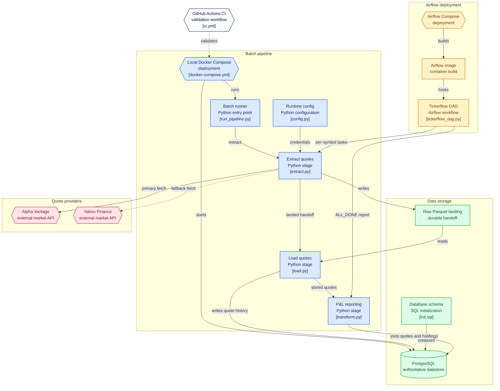

# Tickerflow

> A Dockerized market-data pipeline that fetches equity quotes with provider fallback, stores price data in PostgreSQL, and calculates portfolio profit and loss.


Tickerflow demonstrates a practical data-engineering workflow for financial data:

- Fetch live equity quotes from Alpha Vantage
- Fall back to `yfinance` when the primary provider is rate-limited or unavailable
- Save raw data to Parquet
- Load quote history into PostgreSQL
- Join quotes with holdings to calculate near-real-time P&L
- Schedule the workflow with Airflow

> This project is for education and portfolio tracking only. It does not execute trades or provide investment advice.

## Architecture



# Quick Start
Prerequisites
- Docker Desktop
- [Alpha Vantage API Key](https://www.alphavantage.co/support/#api-key)

## Run
```
git clone https://github.com/poppin554/tickerflow.git
cd tickerflow

cp .env.example .env
```

### Add Alpha Vantage key to .env
```
MARKET_API_KEY=your_key_here
```

### Start the pipeline and database
```
docker compose up --build
```

### On a successful run, Tickerflow will
- Fetch quotes for AMD, AAPL and MSFT
- Save raw quotes into parquet files
- Load quote records into PostgreSQL
- Print a portfolio PnL table to the console

## What happens when provider (AlphaVantage) fails
- If API key limits are reached with AlphaVantage, Tickerflow will fallback to yfinance for financial data.
- This makes the pipeline more resilient, whilst keeping provider failures visible in logs

# Project Structure
```
tickerflow/
├── airflow/                 # Airflow DAG and container setup
├── db/
│   └── init.sql             # PostgreSQL schema initialization
├── scripts/
│   ├── run_pipeline.py      # Pipeline entry point
│   └── manual_load_check.py # Load mock data for local checks
├── src/tickerflow/
│   ├── extract.py           # Quote fetching and Parquet output
│   ├── load.py              # PostgreSQL loading
│   ├── transform.py         # P&L transformation logic
│   └── config.py            # Environment configuration
├── tests/                   # Mocked extraction tests
├── docker-compose.yml
└── README.md
```

## Verify the data
- PostgreSQL database is exposed locally on port ```5432```
- The ```raw_quotes``` fetched by the designated API key can be found on psql or DBeaver. A successful pipeline run creates recent rows with a ```fetched_at``` timestamp

## Testing
- Tests run against mocked provider responses to validate pipeline logic without consuming API quota
```
pip install -r requirements.txt
pytest tests/ -v
```
## Current Capabilities
- ✅ Market quote extraction
- ✅ Primary-provider and fallback-provider logic
- ✅ Parquet landing zone
- ✅ PostgreSQL loading
- ✅ Portfolio P&L query
- ✅ Dockerized local environment
- ✅ Airflow orchestration
- ✅ Automated tests and CI

## Roadmap
- Show portfolio holdings through an application interface
- Historical portfolio performance
- Data-freshness and provider health-checks
- Support for additional market-data sources and user-configurable symbols
- Cloud deployment

## Limitations
- Alpha Vantage's free tier API key has request limits
- ```yfinance``` is an unofficial source and may change without notice
- Current pipeline only runs a fixed set of symbols
- Tickerflow currently reports PnL only in console, planned web dashboard interface.

## Design Decisions
> Choices that were made during the process of building tickerflow
**Why land raw data in Parquet before loading to Postgres?**
- Extraction and loading are decoupled on purpose. If the DB load step fails, the raw fetch isn't lost, it's already on disk in a typed, columnar format. This also mirrors a common real-world pattern (raw landing zone → warehouse) rather than writing straight from the API response into a database table.


**Why Parquet instead of CSV for the landing zone?**
- CSV stores everything as comma-separated text, so the price column has to be split and reparsed every time it is read. Parquet keeps the actual data format and type so the problem doesn't appear downstream. The columnar feature that parquet provides also helps with the PnL query to pull specific columns instead of whole rows. Parquet also compresses better than plain text. 

**Why yfinance as the fallback provider?**
- yfinance does not require an API key and has no known daily quota, so it is a cheap backup to add without having extra setups or quota to monitor. The only flaw is that it is an unofficial mirror around Yahoo Finance rather than a proper API. So it may break without warning with any updates from Yahoo Finance, which is fine because it's not something to rely on as a main source of data provider. 

**Why fall back to yfinance instead of just retrying Alpha Vantage?**
- Alpha Vantage's limit (25 requests/day) is a hard cap, not a temporary error, so retrying wouldn't fix anything. Switching providers lets the pipeline finish the run instead of just failing, and the switch still gets logged so it's not a silent failure.

**Why compute P&L in SQL instead of pandas?**
- The join between `raw_quotes` and `holdings` happens right where the data lives, instead of pulling both tables into Python just to merge them. It also means the PnL logic is its own testable query, separate from the extraction code.

**Why Airflow instead of a cron job or a simple scheduler loop?**
- Each symbol needed to run as its own task so one failing doesn't take down the others, plus a way to pass data between tasks (XCom) and a PnL report step that runs regardless of upstream failures (`TriggerRule.ALL_DONE`). A cron job has no per-task isolation, no retries, no visibility into what failed. Also, Airflow is what's actually used for this kind of orchestration in DE roles.

**Why Docker Compose instead of one container?**
- Postgres and the pipeline are two separate services with different lifecycles — the DB needs to be up and ready before the pipeline runs against it. Compose reflects how this is actually set up in practice, instead of cramming both into a single image.
